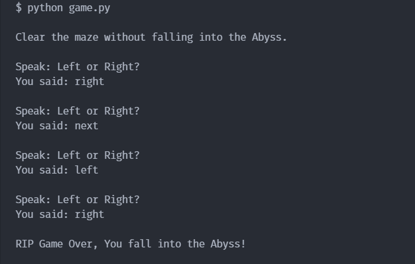

# simple-speech-to-text

A very simple speech to text script that I wrote in Python (using [SpeechRecognition](https://pypi.org/project/SpeechRecognition/) & [PyAudio](https://pypi.org/project/PyAudio/) library) for LocalHackDay challenge.

### `main.py` demo.

### `game.py` demo.

